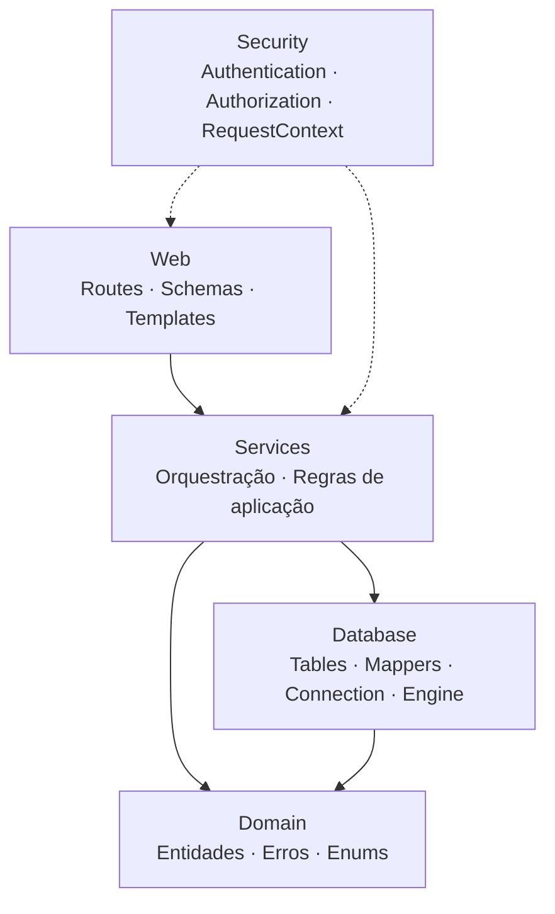

# Recma — Showcase & Arquitetura

<div align="center">
  <strong>Sistema Multi-Tenant B2B de Gestão de Ativos Patrimoniais</strong>
</div>

<br>

> Em desenvolvimento. Uma demonstração interativa em vídeo e capturas de tela da interface serão adicionadas futuramente.

Este repositório apresenta o **Recma** sob a perspectiva de engenharia de software, documentando o problema abordado, levantamento de requisitos, modelagem de domínio, arquitetura, decisões técnicas e direção de evolução do sistema.

O objetivo deste showcase não é reproduzir o código-fonte, mas demonstrar **como o sistema foi pensado, quais problemas arquiteturais foram considerados e quais decisões foram tomadas durante seu desenvolvimento**.

O código-fonte da aplicação é mantido em um repositório separado e privado.

---

## Sobre o projeto

O Recma é um sistema de gestão de ativos patrimoniais desenvolvido com foco em **pequenas e médias empresas** que precisam de uma solução especializada para controle de patrimônio, mas não necessariamente necessitam da complexidade de um ERP completo.

O sistema busca centralizar informações relacionadas aos ativos e seu ciclo de vida, permitindo controlar:

* ativos patrimoniais;
* categorias;
* localizações;
* organizações;
* usuários;
* manutenções;
* movimentações;
* descartes;
* permissões e acesso.

O objetivo é fornecer uma solução especializada para gestão patrimonial, mantendo uma arquitetura que possa evoluir conforme novas necessidades do domínio sejam identificadas.

---

## O problema

A gestão patrimonial pode envolver uma quantidade significativa de informações distribuídas entre planilhas, sistemas internos e processos manuais.

Isso dificulta tarefas como:

* identificar onde determinado ativo está;
* acompanhar alterações de estado;
* registrar manutenções;
* controlar movimentações;
* identificar responsáveis;
* acompanhar descarte;
* restringir o acesso aos dados;
* manter consistência das informações ao longo do tempo.

Para pequenas e médias empresas, utilizar um ERP completo para resolver exclusivamente esse problema pode representar uma complexidade desnecessária.

O Recma foi pensado como uma alternativa especializada, com foco no domínio patrimonial e em seus fluxos específicos.

---

## A solução

O Recma foi projetado como um sistema **B2B multi-tenant**, no qual diferentes organizações podem utilizar a mesma aplicação mantendo isolamento lógico entre seus dados.

O sistema modela o patrimônio considerando seu ciclo de vida e as operações que podem ocorrer sobre os ativos.

Entre os principais conceitos estão:

```text
Organização
    │
    ├── Usuários
    ├── Categorias
    ├── Locais
    │      └── Hierarquia de localizações
    │
    └── Ativos
            ├── Manutenções
            ├── Movimentações
            └── Descartes
```

A arquitetura também considera diferentes níveis de acesso e responsabilidades dentro das organizações.

---

# Arquitetura

A aplicação foi organizada em camadas com responsabilidades distintas:



A principal preocupação dessa organização é manter cada camada responsável por um conjunto específico de problemas e evitar que detalhes de implementação de camadas inferiores sejam propagados para as camadas superiores.

Essa separação também permite evoluir determinadas partes do sistema sem tornar todas as outras dependentes dos detalhes de implementação.

---

# Requisitos

O levantamento inicial foi organizado a partir dos principais fluxos do domínio patrimonial.

### Funcionais

- gerenciar organizações e usuários;
- gerenciar ativos e categorias;
- organizar localizações hierárquicas;
- registrar manutenções;
- controlar movimentações;
- registrar descarte;
- controlar acesso por papel e permissão.

### Não funcionais

- isolamento entre organizações;
- separação entre domínio e infraestrutura;
- consistência transacional;
- testabilidade das regras de negócio;
- controle explícito da persistência;
- possibilidade de evolução da arquitetura.

---

# Separação entre domínio e infraestrutura

Uma das decisões arquiteturais centrais do projeto foi manter o **domínio independente do ORM e das estruturas de persistência**.

Essa decisão não foi tomada apenas para evitar acoplamento com SQLAlchemy.

Ela foi adotada principalmente para seguir os princípios de **Domain-Driven Design**, mantendo as regras e conceitos do negócio representados em objetos de domínio e reduzindo a quantidade de detalhes de infraestrutura que chegam às camadas superiores.

A ideia é estabelecer uma direção de dependências em que o código responsável pelo negócio não precise conhecer detalhes como:

* tabelas do banco;
* objetos ORM;
* sessões;
* mecanismos de carregamento;
* detalhes específicos da persistência.

O fluxo conceitual é:

```text
Database
   ↓
Mapper
   ↓
Domain Entity
   ↓
Application Logic
```

Em vez de fazer a entidade de domínio depender diretamente de um objeto de persistência, o sistema realiza a conversão entre os dois modelos.

Isso também possui uma consequência importante para testes.

Testar uma entidade de domínio simples, formada por estruturas comuns do Python, é significativamente mais direto do que testar objetos fortemente acoplados ao ORM e ao estado de uma sessão de banco.

Assim, o domínio pode ser testado isoladamente, com menor custo e menor dependência de infraestrutura.

A implementação atual utiliza dataclasses imutáveis para representar entidades do domínio.

´´´python
"""
Exemplo de entidade do domínio.
"""

@dataclass(frozen=True, slots=True)
class User:
    id: int
    name: str
    cpf: str
    email: str
    email_verified: bool
    is_active: bool
    role: UserRole
    last_login_at: datetime | None
    created_at: datetime
    has_password: bool = True
´´´

---

# Por que SQLAlchemy Core?

O projeto utiliza **SQLAlchemy Core em vez do SQLAlchemy ORM**.

A escolha foi principalmente motivada pela necessidade de manter maior controle sobre as operações executadas no banco e trabalhar com uma abstração que permanece próxima da sintaxe e dos conceitos do SQL tradicional.

Isso proporciona maior previsibilidade sobre:

* consultas;
* joins;
* filtros;
* atualizações;
* inserts;
* deletes;
* agregações.

Também evita introduzir no domínio conceitos específicos do ORM, como objetos persistentes, sessões e comportamentos implícitos de carregamento.

O projeto utiliza ainda um `TableProxy` próprio para fornecer operações convenientes sobre as tabelas sem transformar essas abstrações em objetos de domínio.

A decisão, portanto, não foi “Core porque ORM é ruim”, mas sim porque **o nível de abstração oferecido pelo Core se adequava melhor às necessidades de controle e previsibilidade deste projeto**.

---

# Multi-tenancy e controle de acesso

Um dos problemas importantes do sistema é impedir que usuários acessem dados pertencentes a organizações fora de seu escopo.

Para isso, a aplicação possui um `RequestContext` utilizado pelas operações que dependem de contexto de segurança.

O contexto representa informações como:

* identidade do usuário;
* organizações acessíveis;
* escopo da operação;
* informações utilizadas para autorização.

As services públicas recebem esse contexto explicitamente quando necessário.

Um padrão utilizado é:

```python
entity = _get_by_id_unscoped(entity_id)

if entity is None:
    raise EntityNotFoundError(...)

context.require_organization_access(entity.organization_id)

# validação da operação
# domínio
# persistência
```

Dessa forma, a autorização deixa de ser uma responsabilidade espalhada aleatoriamente pela aplicação e passa a fazer parte explícita do fluxo de aplicação.

---

# Modelagem do domínio

O domínio representa conceitos e regras do negócio diretamente.

Por exemplo, um ativo possui estados relacionados ao seu ciclo de vida:

```text
NEW
IN_USE
DAMAGED
UNDER_MAINTENANCE
DISPOSED
```

A entidade `Asset` possui comportamento próprio relacionado ao ciclo de vida e valida condições para operações como descarte.

Entre as regras modeladas estão:

* um ativo já descartado não pode ser descartado novamente;
* um ativo em manutenção não pode ser descartado;
* valores inválidos são rejeitados;
* um descarte por venda exige um valor associado.

Isso evita que essas regras existam apenas como condições espalhadas pelas rotas ou consultas.

---

# Localizações hierárquicas

As localizações possuem estrutura hierárquica.

Um exemplo seria:

```text
Matriz
├── Prédio A
│   ├── 1º Andar
│   │   ├── Sala 101
│   │   └── Sala 102
│   └── 2º Andar
│       └── Sala 201
└── Prédio B
    └── Depósito
```

O domínio possui uma `LocationTree` para representar essa estrutura e realizar operações como:

* localizar nós;
* obter descendentes;
* verificar ancestralidade;
* excluir um nó junto com seus descendentes;
* detectar referências para pais inexistentes.

A construção da árvore valida inconsistências estruturais antes de disponibilizá-la para uso pelo domínio.

---

# Controle de acesso

O sistema separa autenticação, autorização e contexto de acesso:

```text
Authentication
       ↓
Authorization
       ↓
RequestContext
```

A estrutura de segurança é dividida em módulos específicos:

```text
security/
├── authentication/
├── authorization/
└── context/
```

Essa separação busca evitar que autenticação, autorização e scoping organizacional sejam tratados como uma única responsabilidade.

O controle de acesso considera papéis e permissões associados aos usuários e ao contexto organizacional.

---

# Ciclo de vida dos ativos

O sistema modela o ativo como uma entidade que atravessa diferentes estados durante sua existência.

Exemplo simplificado:

```text
NEW
 │
 ▼
IN_USE
 │
 ├──► UNDER_MAINTENANCE
 │          │
 │          ▼
 │       IN_USE
 │
 ▼
DISPOSED
```

As transições não são tratadas apenas como alterações arbitrárias de uma coluna.

O domínio valida se uma determinada mudança de estado é permitida naquele momento.

Isso permite que operações como manutenção e descarte respeitem as regras do próprio ciclo de vida.

---

# Regras de negócio

Alguns exemplos de regras representadas no domínio:

### Ativos

* nome não pode ser vazio;
* valor de aquisição não pode ser negativo;
* descarte depende do estado atual;
* venda exige valor recuperado.

### Categorias

* vida útil deve ser positiva;
* valor residual precisa permanecer dentro do intervalo permitido;
* método de depreciação precisa ser válido;
* nomes são normalizados.

### Movimentações

* uma movimentação pode possuir estados de revisão;
* uma movimentação já revisada não pode ser revisada novamente;
* negação exige justificativa.

Essas regras são representadas por erros de domínio específicos em vez de exceções genéricas.

---

# Testes

A estratégia de testes está sendo construída progressivamente junto com a implementação.

A cobertura atual não representa o estado final esperado do projeto.

Já existem testes para partes do domínio e da infraestrutura, incluindo:

* entidades;
* regras de negócio;
* erros de domínio;
* árvores de localização;
* engine;
* conexões;
* mappers;
* roundtrips no banco.

O objetivo é continuar expandindo a suíte à medida que novas funcionalidades e camadas forem implementadas.

A prioridade é testar principalmente **comportamento e regras**, e não simplesmente buscar cobertura percentual.

---

# Estado atual do projeto

O Recma ainda está em desenvolvimento.

Por isso, este showcase deve ser interpretado como uma documentação da **arquitetura e direção atual do projeto**, e não como uma descrição de um produto completamente finalizado.

Alguns pontos importantes:

* nem todas as funcionalidades planejadas foram implementadas;
* nem todas as áreas implementadas possuem a cobertura de testes desejada;
* algumas decisões ainda podem evoluir;
* determinadas partes ainda não foram validadas em cenários de produção;
* a documentação acompanha a evolução da implementação.

Essa característica também faz parte do objetivo do projeto: registrar decisões, validar hipóteses e evoluir a arquitetura conforme novos problemas aparecem.

---

# Analytics e outras extensões futuras

O projeto possui algumas ideias arquiteturais que ainda não fazem parte da implementação atual.

Um exemplo é uma camada específica de **Analytics** para concentrar:

* métricas;
* agregações;
* relatórios;
* cálculos derivados;
* análises sobre o histórico operacional.

Essa separação foi considerada para evitar que consultas analíticas cruzando diferentes domínios fossem incorporadas indiscriminadamente às services transacionais.

No estado atual, essa camada é uma **direção arquitetural planejada**, não uma funcionalidade implementada.

Outras possibilidades futuras incluem mecanismos mais completos de auditoria e rastreabilidade das alterações realizadas no sistema.

---

# Decisões arquiteturais

| Decisão                     | Motivação                                                       |
| --------------------------- | --------------------------------------------------------------- |
| Flask                       | Framework simples e suficiente para o contexto do sistema       |
| SQLAlchemy Core             | Maior controle sobre queries e maior proximidade com SQL        |
| Domain Models independentes | Aplicação dos princípios de DDD e isolamento da infraestrutura  |
| Dataclasses imutáveis       | Modelo de domínio simples e previsível                          |
| Mappers                     | Separar persistência dos objetos de domínio                     |
| Services                    | Centralizar orquestração das operações de aplicação             |
| RequestContext              | Tornar contexto de acesso explícito                             |
| Alembic                     | Versionamento e evolução do schema                              |
| Jinja2 + SSR                | Reduzir complexidade desnecessária no frontend                  |
| Alpine.js                   | Adicionar interatividade sem transformar a aplicação em uma SPA |

---

# Desafios e aprendizados

O desenvolvimento do Recma serviu também como exercício de análise de trade-offs arquiteturais.

Entre os principais desafios estão:

### Modelar antes de abstrair

Nem toda abstração deve ser criada porque determinada tecnologia permite.

A arquitetura foi sendo construída conforme os problemas reais do domínio surgiam.

### Manter o domínio independente

Separar o domínio do banco exige mapeamento adicional e mais código, mas também produz um modelo mais simples de testar e menos dependente da infraestrutura.

### Equilibrar abstração e controle

O uso de SQLAlchemy Core representa justamente esse equilíbrio: utilizar uma biblioteca madura de acesso a banco sem abrir mão de controle explícito sobre as queries.

### Evoluir sem assumir que a arquitetura está pronta

Como o projeto ainda está em desenvolvimento, decisões podem ser revistas quando novas necessidades ou problemas forem identificados.

---

# Roadmap

Entre os próximos passos estão:

* finalizar funcionalidades ainda pendentes;
* ampliar a cobertura de testes;
* validar cenários ainda não exercitados;
* evoluir a interface de manutenção e movimentação;
* desenvolver dashboards e relatórios;
* avaliar mecanismos de auditoria;
* avaliar uma camada analítica;
* disponibilizar uma demonstração navegável.

O roadmap não representa funcionalidades já implementadas, mas a direção atual de evolução do projeto.

---

# Demo

> **Em breve**

Uma demonstração visual do sistema será adicionada futuramente.

A seção deverá apresentar, entre outros pontos:

* autenticação;
* gerenciamento de organizações;
* usuários e permissões;
* gerenciamento de ativos;
* categorias;
* localizações;
* manutenção;
* movimentações;
* dashboards e relatórios.

Até a disponibilização da demo, esta seção permanece propositalmente reservada para a futura apresentação visual do sistema.

---

<div align="center">
  <p>Idealizado e desenvolvido por <b>Jonatha Gabriel</b>.</p>
  <a href="https://github.com/j0ng4b">GitHub</a> • <a href="https://linkedin.com/in/j0ng4b">LinkedIn</a>
</div>

---

<div align="center">
  <strong>Recma</strong><br>
  Projeto de engenharia de software para gestão de ativos patrimoniais.
</div>
